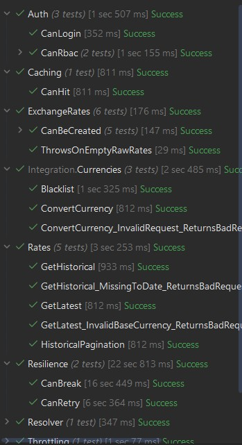
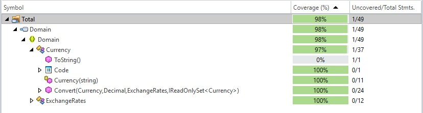

# Currency Conversion API

This API integrates with the Frankfurter exchange rate API and provides endpoints for retrieving current and historical exchange rates and converting between currencies. It's designed with resilience, security, and extensibility in mind.

- [Currency Conversion API](#currency-conversion-api)
  - [Setup Instructions](#setup-instructions)
  - [Tech Stack](#tech-stack)
    - [Backend](#backend)
    - [Resilience \& Observability](#resilience--observability)
    - [Caching](#caching)
    - [Testing](#testing)
  - [API Endpoints](#api-endpoints)
    - [1. Login](#1-login)
    - [2. Retrieve Latest Exchange Rates](#2-retrieve-latest-exchange-rates)
    - [3. Currency Conversion](#3-currency-conversion)
    - [4. Historical Exchange Rates with Pagination](#4-historical-exchange-rates-with-pagination)
  - [Solution Structure](#solution-structure)
    - [Domain](#domain)
    - [Api](#api)
    - [Integration](#integration)
    - [Unit](#unit)
  - [Architecture \& Design Decisions](#architecture--design-decisions)
    - [Vertical Slice Architecture over Onion Architecture](#vertical-slice-architecture-over-onion-architecture)
    - [Short names](#short-names)
    - [REST over RPC](#rest-over-rpc)
    - [Declarative validation using Filters](#declarative-validation-using-filters)
    - [TUnit over xUnit/NUnit](#tunit-over-xunitnunit)
    - [Fakes over mocks in testing](#fakes-over-mocks-in-testing)
    - [Resolver over traditional factory pattern](#resolver-over-traditional-factory-pattern)
    - [No Overabstraction](#no-overabstraction)
    - [No DTOs](#no-dtos)
    - [`.slnx` over traditional `.sln`](#slnx-over-traditional-sln)
  - [Assumptions](#assumptions)
  - [Possible Improvements](#possible-improvements)
  - [Test Coverage](#test-coverage)

## Setup Instructions
1. Update your Visual Studio / Rider to latest
1. Clone this repository
    ```bash
    git clone https://github.com/Mithgroth/CurrencyConverter.git
    cd CurrencyConverter
    ```
1. Run the `Api` project as the startup project
1. Tests use [TUnit](https://tunit.dev/) for execution. If you're using Visual Studio or JetBrains Rider:
    - Visual Studio: Go to `Tools → Options → Test → Enable Testing Platform Server Mode`
    - Rider: Go to `Preferences → Tools → Unit Testing → Enable Testing Platform Support`
    
    Then build the test projects:
    ```bash
    dotnet build tests/Unit
    dotnet build tests/Integration
    ```

    To run tests via CLI:
    ```bash
    dotnet test tests/Unit
    dotnet test tests/Integration
    ```
    Or use the IDE test explorer.

## Tech Stack

### Backend
- ASP.NET Core, C#
- Minimal API + Vertical Slice architecture
- JWT authentication

### Resilience & Observability
- Polly (retry, circuit breaker)
- Serilog (structured logs)
- OpenTelemetry (distributed tracing)

### Caching
- MemoryCache (can swap to Redis)

### Testing
- TUnit (unit + integration)
- TDD mindset
- Fake-driven, not mock-heavy

## API Endpoints

### 1. Login
- `POST /api/v1/auth/login`
- Use JSON body `{ "name": "Intern", "password": "123456" }` for Intern who cannot access currency conversion
- Use JSON body `{ "name": "Expert", "password": "123456" }` for Financial Expert who can access all endpoints

### 2. Retrieve Latest Exchange Rates
- `GET /api/v1/rates?baseCurrency={baseCurrency}`
- Fetch the latest exchange rates for a specific base currency (e.g., EUR)

### 3. Currency Conversion
- `POST /api/v1/currencies/conversion`
- Convert amounts between different currencies
- Excludes TRY, PLN, THB, and MXN (returns bad request if these currencies are involved)
- Use JSON body `{ "from": "EUR", "to": "USD", "amount": 100 }`

### 4. Historical Exchange Rates with Pagination
- `GET /api/v1/rates/historical?baseCurrency={baseCurrency}&from={startDate}&to={endDate}&page={pageNumber}&pageSize={pageSize}`
- Retrieve historical exchange rates for a given period with pagination

## Solution Structure
### Domain
- Enforces business rules
- Tactical DDD
- Unaware of infrastructure
- Tested by `Unit`

### Api
- Minimal API
- Vertical slice architecture
- Engagement layer for `Domain`
- Holds infrastructure specific concerns like throttling or authentication

### Integration
- E2E integration tests
- [TUnit](https://tunit.dev/) based
- Mainly targets `Api` endpoints

### Unit
- Faker based unit testing
- [TUnit](https://tunit.dev/) based
- Mainly targets `Domain` business logic

## Architecture & Design Decisions

### Vertical Slice Architecture over Onion Architecture
Onion architecture offers abstraction. But this comes at a cost of maintainability. To track an endpoint / user journey, you can end up looking for 4-5 different locations:
- `Controllers/UserController`
- `Service/UserService`
- `Repository/UserService`
- `Models/User`
...

Compared to Clean Architecture's "layers over layers" approach, vertical slice offers simplicity:


Instead of "logical type" grouping, you group your files based on "features" - what they do.

This architecture is popularized by Jimmy Bogard (author of [AutoMapper](https://github.com/AutoMapper/AutoMapper) and [MediatR](https://github.com/jbogard/MediatR)) in .NET: https://www.jimmybogard.com/vertical-slice-architecture/ 

### Short names
I've been in enterprise-style .NET for so long and seen lot of namings like this:
```csharp
namespace CompanyName.ProductName.Subsystem.FeatureLayer.BusinessLogic.Services.Implementations
{
    public class CustomerAccountRegistrationWorkflowOrchestratorService : ICustomerAccountRegistrationWorkflowOrchestratorService
    {
        private readonly ICustomerAccountDataValidationRuleSetProvider _customerAccountDataValidationRuleSetProvider;

        public CustomerAccountRegistrationWorkflowOrchestratorService(
            ICustomerAccountDataValidationRuleSetProvider customerAccountDataValidationRuleSetProvider)
        {
            _customerAccountDataValidationRuleSetProvider = customerAccountDataValidationRuleSetProvider;
        }

        public Task<StandardizedOperationResult<CustomerAccountCreationResponse>> ExecuteCustomerAccountCreationWorkflowAsync(
            CustomerAccountCreationRequestDto requestDto,
            CancellationToken cancellationToken)
        {
            // ...
        }
    }
}
```
"As descriptive as possible" does not necessarily mean using 40+ character names. It is a huge hit to readability and maintainability. Therefore, personally I prefer the shortest name possible, and even in favour of using `namespace`. Although this is an unpopular opinion, `Services/SomeService` reminds me the dark days of prefixes every SQL Server table with `tbl_`.

Also for tests, I prefer an approach that is readable like a newspaper:



Testing for fails under certain conditions is the exception to this rule. But even that can be handled with [parameterized tests](https://github.com/Mithgroth/CurrencyConverter/blob/46dd71db23d4e38794805c571f3386e8d58a5cf3/tests/Unit/Currencies.cs#L36C10-L37C110).


### REST over RPC
While mapping Frankfurter API to mine, I prefered a more REST approach.

Instead of adapting `https://api.frankfurter.dev/v1/latest` as `api/v1/rates/latest` which is RPC, I simply do `api/v1/rates`.

### Declarative validation using Filters
Instead of mixing validation logic with handler code, this API applies validation declaratively using custom filters and Minimal API binding. It ensures consistent behavior across endpoints and clear separation of concerns.


### TUnit over xUnit/NUnit
TUnit is a young, pretty established, underrated modern testing framework. It already has superior features over both traditional testing frameworks, but the main selling points for me were:
- Uses source generators behind the scenes
- True parallelism, faster test suite execution time
- Lifecycle hooks
- Straightforward syntax

Here is the author's comparision of TUnit to other two: https://tunit.dev/docs/comparison/framework-differences 

**Important Note:** TUnit has one setup quirk you should be aware of, otherwise **you won't be able to see the tests in Test Explorer**.
- For Visual Studio, you need to enable "*Use testing platform server mode*": https://tunit.dev/docs/tutorial-basics/running-your-tests/#visual-studio
- For Rider, you need to check "*Enable Testing Platform support*": https://tunit.dev/docs/tutorial-basics/running-your-tests/#rider 

It's built on MSBuild, the rest is the same: Build the project, tests should appear in Test Explorer.

### Fakes over mocks in testing
Mock-heavy testing often leads to brittle and overspecified tests that tightly couple to implementation details. When every interaction is explicitly verified (.Verify(x => x.DoSomething())), refactoring becomes painful even when behavior stays the same.

Instead, I prefer fakes. Simple in-memory or dummy implementations that behave predictably:

- Encourages behavior-based testing, not implementation verification
- More robust to refactors, since you don’t care how something is called, just what it does
- Improves test readability: Less noise from setup and expectations
- Easier to debug: You can log or inspect state within your fake

Compare this:

```csharp
// Mock-based
mockRepo.Setup(r => r.GetByIdAsync(id)).ReturnsAsync(user);
mockService.Verify(s => s.LogUserLookup(user));
```
vs.
```csharp
// Fake-based
var repo = new FakeUserRepo(users);
var service = new UserService(repo);
``` 

Fakes align better with TDD and domain-focused thinking. I generally avoid mocking unless I'm forced to e.g. external systems or legacy APIs.

### Resolver over traditional factory pattern
Traditional factory patterns in C# often rely on explicit switch statements or multiple if-else blocks to determine which implementation to return based on a string or enum input. This creates rigid and brittle code, especially when scaling the number of implementations:
```csharp
public IExchangeRateProvider GetProvider(string name)
{
    return name switch
    {
        "Frankfurter" => new FrankfurterProvider(),
        "ECB" => new EcbProvider(),
        _ => throw new ArgumentException("Unknown provider.")
    };
}
```
This might work fine at first, but:
- You need to manually update the factory every time a new implementation is added.
- It violates the Open/Closed Principle.
- It creates a central point of change and makes testing less flexible.

Instead, I prefer using a Resolver, a simple DI-powered dictionary of keyed services:
```csharp
public class ExchangeRateProviderResolver(Dictionary<string, IExchangeRateProvider> providers)
    : IExchangeRateProviderResolver
{
    public IExchangeRateProvider Get(string name)
        => providers.TryGetValue(name, out var provider)
            ? provider
            : throw new KeyNotFoundException($"Unknown exchange rate provider: '{name}'");
}

```
This approach gives you:
- **Extensibility**: Just register new providers in DI with a name, the resolver picks it up automatically.
- **Testability**: You can easily inject test providers in integration tests.
- **Loosely coupled design**: The domain code never needs to know which provider it’s dealing with.

It's simple, powerful, and keeps your codebase open for extension but closed for modification.

### No Overabstraction
Uncle Bob wasn't wrong with his Dependency Inversion Principle, but this is one of the most misused and misunderstood concepts in .NET. This sample is built very clearly: Not everything needs an interface.

In .NET context, an interface is a **contract between types**. If there are no type**s**, there should be no interfaces.

This usually is an unpopular opinion, but here's James Newton-King's (Microsoft Developer, author of [Newtonsoft.Json](https://github.com/JamesNK/Newtonsoft.Json)) explanation to this cargo-cult programming: https://x.com/JamesNK/status/1387592048254062592 

### No DTOs
Probably another unpopular opinion, but eh.

I avoid naming anything `*Dto`. It's vague, generic, and completely disconnected from intent. What does `OrderDto` mean? Is it for creating an order? Returning one? Updating it? Mapping from a database row? Nobody knows until they open the class.

Instead, I use intent-revealing names:

- `OrderRequest`
- `OrderResponse`
- `CreateOrderCommand`
- `OrderSummary`

This pattern is sometimes referred to as **REPR**. It makes the purpose of each class immediately clear, especially useful when navigating large codebases, or when collaborating with multiple teams.

Here's Martin Fowler's explanation: https://martinfowler.com/bliki/LocalDTO.html

### `.slnx` over traditional `.sln`
Instead of the traditional `.sln` solution file, this project uses `.slnx` — a simplified and Git-friendly format introduced recently. It avoids the XML and GUID noise typical of `.sln` files, making diffs cleaner and collaboration smoother. You can still open and run the project in Visual Studio or Rider without any issues. For CLI workflows and code review clarity, `.slnx` is simply the better default.

You can check the details here: https://devblogs.microsoft.com/dotnet/introducing-slnx-support-dotnet-cli/ 

## Assumptions
- Users are hardcoded for brevity. Authentication package can include a lot of things like "Forgot password", "Register", "Register with external providers", etc.
- Rate-limiting is enforced per client identity since spec does not mention any specifics
- Exchange rates are retrieved in EUR as default for latest
- No persistent storages are configured, as spec does not mention any
- Since there is no persistency, models (in `Domain` project) are not modeled for ORMs like Entity Framework, they don't have parameterless constructors
- Tests are the main point of evaluation instead of Postman/Insomnia calls
- MemoryCache is used for horizontal scalability, in a Production environment a centralized cache solution like Redis would be preferred
- Rate conversion happens on latest rates, historical data is unsupported since spec does not mention any specifics
- Skipped bank holidays for brevity (like 1st of January)

## Possible Improvements
- Implement 304 responses with [Delta](https://github.com/SimonCropp/Delta), if persistent storage can be Postgres
- Add bank holidays, not sure how
- Implement CQRS, plan persistency as a read-only & write-only duo like Redis + Postgres in production
- Replace `MemoryCache` with a Redis implementation in production
- Implement proper authentication for production
- Use Prometheus & Grafana for monitoring in production
- Orchestrate and deploy with .NET Aspire
- Focus on quality over quantity for tests - instead of code coverage percent, use flaky test detection tools
- Add health checks

## Test Coverage
We have two test projects to serve different parts of the application, and also behave differently.

Following code coverage reports were generated by JetBrains dotCover:

- Business logic is isolated and unit tested by `Unit`:

    

- Infrastructure is E2E tested by `Integration`:

    
